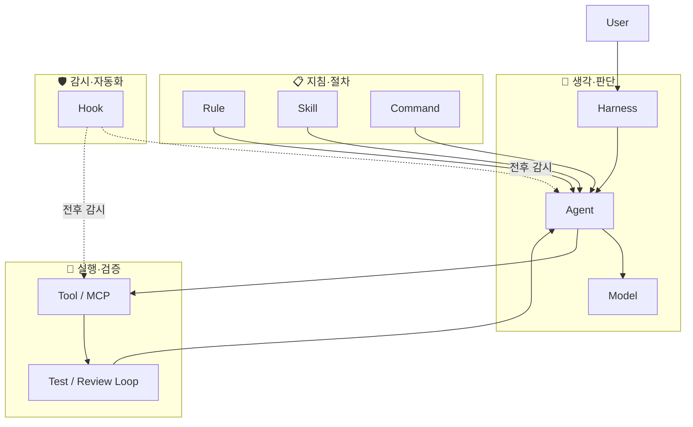
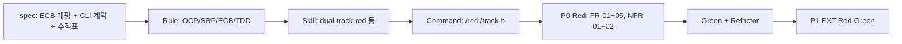
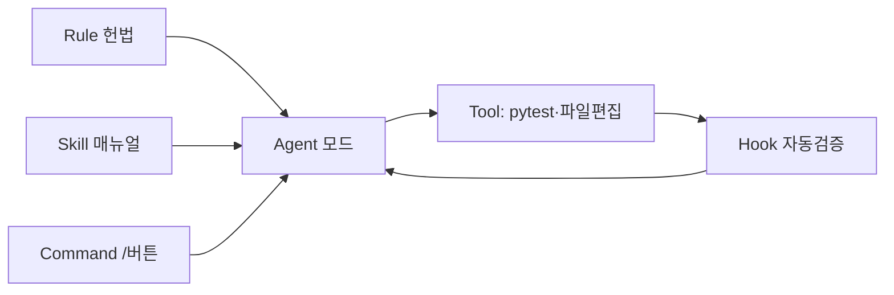

# UnitConverter_04 — Cursor Session Transcript

| 항목 | 값 |
|------|-----|
| Session ID | c771b08d-d5fa-4848-b845-aa0d22644bf5 |
| Export date | 2025-06-05 |
| Project | UnitConverter_04 |
| Raw JSONL | transcript_c771b08d.jsonl |

---

## Turn 1 — USER

@c:\DEV\UnitConverter_04\  프로젝트에서 아래 8계층 + Hook이 각각 무슨 역할인지 한 줄씩 설명해줘.
초보자용으로 비유(헌법, 매뉴얼, 버튼, CCTV 등)도 붙여줘.
- Model, Agent, Harness
- Rule, Skill, Command
- Tool/MCP, Test/Review Loop
- Hook
아직 .cursorrules, Skill, Command, hooks.json 은 없다고 가정.

---

## Turn 2 — ASSISTANT

프로젝트 구조와 각 계층이 어떻게 정의돼 있는지 먼저 살펴볼게요.

_[Tools: Glob, SemanticSearch]_

---

## Turn 3 — ASSISTANT

_[Tools: Grep, Glob, Read, Read]_

---

## Turn 4 — ASSISTANT

_[Tools: Read, Read, Read]_

---

## Turn 5 — ASSISTANT

`UnitConverter_04`는 아직 순수 Python 코드(`UnitConverter.py`, `README.md`)만 있고, Cursor 설정 파일은 없는 상태입니다. 아래 설명은 **이 프로젝트에 Cursor AI를 붙였을 때** 각 계층이 어떤 역할을 하는지, 초보자용 비유와 함께 정리한 것입니다.

---

## 전체 그림 (한눈에)



---

## 1층: Model, Agent, Harness — “누가, 어디서, 어떻게 생각하나”

| 계층 | 한 줄 설명 | 비유 |
|------|-----------|------|
| **Model** | 실제로 코드를 읽고, OCP/SRP 설계를 제안하고, 테스트 코드를 **문장으로 생성**하는 AI 두뇌. | **교수** — meter/feet 변환 공식을 이해하고 답을 내는 사람 |
| **Agent** | “입력 검증 추가해줘”, “TC 작성해줘” 같은 요청을 받아 **계획 → 파일 수정 → 테스트 실행** 순서로 일을 조율하는 실행자. | **현장 반장** — 교수( Model )에게 물어보고, 일 순서를 정해 진행 |
| **Harness** | Cursor IDE, Ask/Agent 모드, 열린 파일·프로젝트 경로(`c:\DEV\UnitConverter_04`) 등 AI가 일하는 **작업 환경 전체**. | **사무실 + 책상** — 교수와 반장이 앉아 일하는 공간 |

> 지금 상태: Harness(Cursor)만 있고, Model·Agent는 Cursor 기본 설정으로 동작 중. Rule/Skill 등은 아직 없음.

---

## 2층: Rule, Skill, Command — “항상 지켜야 할 것 / 특정 업무 매뉴얼 / 단축 버튼”

| 계층 | 한 줄 설명 | 비유 |
|------|-----------|------|
| **Rule** | “OCP 준수”, “커밋은 요청 시만”, “Python 스타일은 이렇게”처럼 **매 대화마다 항상 적용**되는 프로젝트 규칙 (`.cursor/rules/`, 사용자 Rule). | **헌법** — 어떤 작업이든 반드시 지켜야 하는 기본 원칙 |
| **Skill** | “단위 변환 TC 작성법”, “설정 파일(JSON) 외부화 절차”처럼 **특정 작업이 나올 때만** 꺼내 쓰는 전문 매뉴얼 (`SKILL.md`). | **직무 매뉴얼** — “테스트 코드 작성” 챕터만 필요할 때 펼치는 책 |
| **Command** | `/add-unit`, `/run-tests` 같은 **슬래시 명령**으로 자주 쓰는 프롬프트·워크플로를 한 번에 실행. | **원터치 버튼** — “TC 돌려” 버튼 한 번 누르면 정해진 절차 시작 |

> 지금 상태: `.cursorrules`, Skill, Command **없음** → Agent는 README 요구사항과 대화 내용만 보고 판단.

---

## 3층: Tool/MCP, Test/Review Loop — “손·발 + 품질 검사”

| 계층 | 한 줄 설명 | 비유 |
|------|-----------|------|
| **Tool / MCP** | 파일 읽기·수정, 터미널(`python UnitConverter.py`), grep, GitHub MCP 등 AI가 **실제로 손대는 도구**. | **공구 + 외부 장비** — 드라이버(파일 편집), 멀티미터(터미널 실행), GitHub 연동 |
| **Test / Review Loop** | `pytest` 실행 → 실패하면 수정 → 다시 테스트하는 **품질 확인 사이클**; README의 “TC 구현”, “입력값 검증 TC” 요구와 직결. | **CCTV + 검수대** — 만든 코드가 meter↔feet 변환이 맞는지 반복 확인 |

> 지금 상태: Tool은 Cursor 기본 제공; Test Loop는 **아직 테스트 파일 없음** → Agent가 TC를 만들고 돌리는 루프가 아직 없음.

---

## 4층: Hook — “일어나기 전·후 자동 감시”

| 계층 | 한 줄 설명 | 비유 |
|------|-----------|------|
| **Hook** | 파일 저장 후 자동 `pytest`, 위험한 `git push --force` 차단 등 **Agent 이벤트 전후**에 스크립트가 자동 실행 (`hooks.json`). | **출입 통제 + CCTV** — “코드 수정됐으면 자동으로 테스트”, “위험 명령은 문 앞에서 차단” |

> 지금 상태: `hooks.json` **없음** → 모든 검증·차단은 Agent가 수동으로 하거나, 사용자가 직접 실행해야 함.

---

## 이 프로젝트에 대입한 예시

README 요구사항( OCP, SRP, TC, JSON 설정 외부화 )을 Cursor 8계층으로 보면:

| 하고 싶은 일 | 주로 쓰는 계층 |
|-------------|---------------|
| “meter:2.5 입력 검증 추가해줘” | Agent + Model + Tool |
| “항상 OCP/SRP 지켜” | **Rule** (아직 없음 → 대화로만 전달) |
| “단위 변환 TC 작성 절차대로” | **Skill** (아직 없음) |
| “/test-converter” 한 방에 TC 돌리기 | **Command** (아직 없음) |
| `python -m pytest` 로 검증 | Tool + **Test/Review Loop** |
| 저장할 때마다 자동 테스트 | **Hook** (아직 없음) |

---

## 한 줄 요약 (8 + Hook)

1. **Model** — 생각하고 코드/설계를 쓰는 AI 두뇌 (교수)  
2. **Agent** — 요청을 받아 계획하고 Tool을 부리는 실행자 (반장)  
3. **Harness** — Cursor IDE + 프로젝트 컨텍스트라는 작업 환경 (사무실)  
4. **Rule** — 매번 지켜야 할 프로젝트 헌법 (아직 없음)  
5. **Skill** — 특정 업무용 상세 매뉴얼 (아직 없음)  
6. **Command** — 자주 쓰는 작업 단축 버튼 (아직 없음)  
7. **Tool/MCP** — 파일·터미널·외부 서비스 등 실제 손/발  
8. **Test/Review Loop** — 테스트·검수로 품질 확인하는 CCTV 검수대  
9. **Hook** — 작업 전후 자동 감시·차단·후처리 (아직 없음)

원하시면 Agent 모드에서 `UnitConverter_04`용 Rule/Skill/Command/hooks.json을 **어떤 순서로 추가하면 좋은지**도 단계별로 정리해 드릴 수 있습니다.

---

## Turn 6 — USER

UnitConverter_04 용 ECB + Dual-Track TDD용 최소 Harness를 만들어줘.
- pyproject.toml (pytest만)
- src/boundary, src/control, src/entity (빈 __init__.py)
- tests/entity, tests/control, tests/boundary (빈 __init__.py)
- Report/01, Report/02 는 이미 있다고 가정
코드·테스트 본문은 아직 작성하지 마. Harness 골격만.

---

## Turn 7 — ASSISTANT

프로젝트 현재 구조를 확인한 뒤 ECB + Dual-Track TDD용 Harness 골격만 추가합니다.

_[Tools: Glob, Read]_

---

## Turn 8 — ASSISTANT

_[Tools: Write, Write, Write, Write, Write, Write, Write]_

---

## Turn 9 — ASSISTANT

pytest가 골격만으로 정상 동작하는지 확인합니다.

_[Tools: Shell]_

---

## Turn 10 — ASSISTANT

_[Tools: Shell]_

---

## Turn 11 — ASSISTANT

ECB + Dual-Track TDD용 Harness 골격을 추가했습니다. 코드·테스트 본문은 넣지 않았습니다.

```
UnitConverter_04/
├── pyproject.toml
├── src/
│   ├── entity/__init__.py
│   ├── control/__init__.py
│   └── boundary/__init__.py
└── tests/
    ├── entity/__init__.py      ← Track 1 (Entity)
    ├── control/__init__.py     ← Track 1 (Control)
    └── boundary/__init__.py    ← Track 2 (Boundary)
```

**`pyproject.toml`** — pytest만 dev 의존성, `testpaths=tests`, `pythonpath=src`로 `src/` 모듈 import 준비.

**ECB ↔ Dual-Track 매핑**

| 계층 | 소스 | 테스트 트랙 |
|------|------|-------------|
| Entity | `src/entity/` | `tests/entity/` — 순수 도메인 (Track 1) |
| Control | `src/control/` | `tests/control/` — 유스케이스 조율 (Track 1) |
| Boundary | `src/boundary/` | `tests/boundary/` — I/O·통합 (Track 2) |

`Report/01`, `Report/02`는 생성하지 않았습니다. `pytest --collect-only`는 테스트 0건 수집(exit 5)으로 골격만 정상 동작합니다.

다음 단계로 `tests/entity/`부터 Red 테스트를 추가하면 됩니다.

---

## Turn 12 — USER

[Image]
[Image]
[Image]
[Image]
<image_files>
The following images were provdied by the user and saved to the workspace for future use:
1. C:\Users\usejen_id\.cursor\projects\c-DEV-UnitConverter-04/assets/c__Users_usejen_id_AppData_Roaming_Cursor_User_workspaceStorage_baaa0f73f0a06ddecb6fcd58dfb9e34a_images_image-94e28975-3457-48e7-8c51-1b5fd03700c1.png
2. C:\Users\usejen_id\.cursor\projects\c-DEV-UnitConverter-04/assets/c__Users_usejen_id_AppData_Roaming_Cursor_User_workspaceStorage_baaa0f73f0a06ddecb6fcd58dfb9e34a_images_image-d8f2b4b6-9468-4b34-8915-a0b118723ac4.png
3. C:\Users\usejen_id\.cursor\projects\c-DEV-UnitConverter-04/assets/c__Users_usejen_id_AppData_Roaming_Cursor_User_workspaceStorage_baaa0f73f0a06ddecb6fcd58dfb9e34a_images_image-f4aa4da0-97ed-421c-88ba-067526c851a9-65b72a2f-daa9-4aad-b58b-7c74282d8e11.png
4. C:\Users\usejen_id\.cursor\projects\c-DEV-UnitConverter-04/assets/c__Users_usejen_id_AppData_Roaming_Cursor_User_workspaceStorage_baaa0f73f0a06ddecb6fcd58dfb9e34a_images_image-ec29034d-cf23-484a-b75d-6083eec0af54-95114b8f-3a2d-4ad0-9120-d06e581a9e70.png

These images can be copied for use in other locations.
</image_files>
UnitConverter_04 프로젝트 자료야. 현재 staging, spec 단계 진행중인데 Harness 맞게 구성되었는지랑 이후 Rule, Skill, Command 까지 수행되어야 하는데 의견 들려줘

---

## Turn 13 — ASSISTANT

프로젝트 자료와 현재 Harness 구조를 대조해 의견을 정리하겠습니다.

_[Tools: Glob, Glob, Read]_

---

## Turn 14 — ASSISTANT

_[Tools: Read, Glob]_

---

## Turn 15 — ASSISTANT

## 총평: staging/spec 단계 Harness — **방향은 맞고, spec 정합성 보완 3~4가지만 하면 됨**

현재 Harness는 **ECB + Dual-Track TDD 골격**으로 staging/spec에 적합합니다. PRD·추적표·타깃 아키텍처 슬라이드와 **큰 틀은 일치**하지만, 슬라이드에 나온 **모듈 단위(SRP 4분할)** 와 **CLI 진입점(`python -m unit_converter`)** 은 아직 Harness에 반영되지 않았습니다. spec 단계에서 이 갭을 메우면 이후 Rule → Skill → Command → Red 테스트 순서가 깔끔해집니다.

---

## 1. Harness 적합성 점검

### 잘 맞는 부분

| 항목 | 현재 Harness | PRD/슬라이드와의 관계 |
|------|-------------|---------------------|
| ECB 3계층 | `src/entity`, `src/control`, `src/boundary` | NFR-02의 Parser/Registry/Converter/Printer를 계층별로 배치 가능 |
| Dual-Track 테스트 | `tests/entity`, `tests/control`, `tests/boundary` | 슬라이드 Track B(도메인) ↔ `tests/entity`, Track A(경계) ↔ `tests/boundary` |
| pytest만 | `pyproject.toml` + `pythonpath = ["src"]` | spec 단계에 적합한 최소 Harness |
| 레거시 분리 | `UnitConverter.py`는 그대로, `src/`는 비어 있음 | 시드 분석 슬라이드의 “37줄 procedural → 재구현” 흐름과 맞음 |

### spec 단계에서 보완하면 좋은 갭

**① 슬라이드 폴더명 vs ECB 폴더명 — 매핑 문서 필요**

슬라이드 타깃 아키텍처는 `domain/`, `app/`, `infrastructure/`이고, Harness는 `entity/control/boundary`입니다. **둘 다 맞는 설계**이지만, Report/02(또는 spec 문서)에 아래 매핑을 한 줄이라도 고정해 두는 것이 좋습니다.

| 슬라이드 모듈 | ECB 배치 (권장) | SRP 역할 |
|--------------|----------------|----------|
| `length_unit.py`, `unit_registry.py`, `converter.py` | `src/entity/` | Registry, Converter |
| 유스케이스 조율 (전 단위 변환, 동적 등록) | `src/control/` | Control |
| `input_parser.py`, `output_formatter.py`, `cli.py` | `src/boundary/` | Parser, Printer |
| `config_loader.py` | `src/boundary/` 또는 `src/entity/` | EXT-01 — spec에서 한쪽만 선택 |

**② CLI 진입점 스캐폴드 없음**

PRD 예시는 `python -m unit_converter "meter:2.5"`인데, 현재는:

- `pyproject.toml`의 `name = "unit-converter"` (하이픈)
- `unit_converter` 패키지/`__main__.py` 없음

spec 단계에서 **패키지명·진입점·실행 방식**을 Report에 확정해 두면 Track A(`tests/boundary/`) Red 테스트 작성 시 혼선이 줄어듭니다.

**③ 추적성(Traceability) 스캐폴드 없음**

추적표(FR-01~05, NFR-01~02, EXT-01~03)와 테스트 폴더가 아직 1:1로 연결되지 않았습니다. Harness 본문은 비워도 되지만, spec 문서에 **테스트 파일·함수 네이밍 규칙**은 미리 정하는 것이 좋습니다.

예: `tests/entity/test_fr02_convert_all_units.py`, `tests/boundary/test_fr01_parse_input.py`

**④ `tests/control/` 역할 정의**

슬라이드는 Dual-Track을 2트랙(Domain / Boundary)으로만 그렸습니다. 3폴더 Harness는 더 세분화된 구조이므로 spec에서 역할을 명시하는 것이 좋습니다.

- **Track B (빠른 단위)**: `tests/entity/` + `tests/control/`
- **Track A (CLI·통합)**: `tests/boundary/`

Control은 “Parser 결과 → Registry/Converter 호출 → Formatter에 넘김” 같은 **유스케이스 조율** 테스트에 두면 NFR-02와 잘 맞습니다.

---

## 2. staging/spec 단계에서 Harness가 “완료”로 볼 수 있는 기준

코드·테스트 본문 없이도, 아래가 Report/spec에 있으면 Harness는 **spec-ready**로 볼 수 있습니다.

1. ECB ↔ 모듈 매핑표 (위 표 수준)
2. Dual-Track 실행 명령 정의  
   - Track B: `pytest tests/entity tests/control`  
   - Track A: `pytest tests/boundary`
3. FR/NFR/EXT → 테스트 ID 매핑 (추적표 그대로 + 파일명 규칙)
4. CLI 실행 계약: `python -m unit_converter`, `--format json|csv|table`
5. P0(FR+NFR) 먼저, P1(EXT) 나중 — TDD 순서

현재는 **1~5가 코드가 아니라 문서(spec)에 아직 없거나 미확정** 상태로 보입니다. Harness 폴더 구조 자체는 OK, **spec 문서와의 정합성**이 다음 작업입니다.

---

## 3. 이후 Rule → Skill → Command 순서 의견

8계층 관점에서 staging/spec 다음은 **Rule(헌법) → Skill(매뉴얼) → Command(버튼)** 순이 맞습니다. Harness가 “어디에 넣을지”, Rule/Skill/Command가 “어떻게 넣을지”를 고정합니다.

### Rule (먼저 — `.cursor/rules/` 또는 user rules)

PRD·NFR에서 **항상 적용**할 헌법 5~7조면 충분합니다.

| Rule 주제 | 내용 (PRD에서 추출) |
|-----------|-------------------|
| ECB 경계 | `entity`는 I/O 금지, `boundary`는 변환 로직 금지 |
| OCP (NFR-01) | 새 단위 추가 시 `converter.py` 수정 금지 → Registry/설정만 |
| SRP (NFR-02) | Parser / Registry / Converter / Formatter 파일 분리 유지 |
| Dual-Track TDD | P0 Red → Green → Refactor, Track B 먼저 Track A |
| 추적성 | 테스트는 FR/NFR/EXT ID를 docstring 또는 파일명에 포함 |
| 레거시 | `UnitConverter.py` 참고만, `src/`에 새로 구현 |

`.cursorrules` 대신 `.cursor/rules/*.mdc` 권장 — globs로 `src/entity/**`, `tests/boundary/**` 등 계층별 Rule 분리 가능.

### Skill (Rule 다음 — 작업별 매뉴얼)

Rule이 “지켜라”면 Skill은 “이렇게 해라”입니다. UnitConverter_04에 특히 유용한 Skill 3~4개:

| Skill | 트리거 | 내용 |
|-------|--------|------|
| **dual-track-red** | “FR-XX Red 테스트 작성” | Given/Then 형식, 어느 track/폴더에 쓸지, pytest 실행 |
| **add-length-unit** | “inch 추가”, OCP 검증 | `LengthUnit` + Registry 등록만, converter 미수정 |
| **boundary-cli** | Track A, `--format` | `cli.py` + formatter, subprocess 테스트 패턴 |
| **config-externalize** | EXT-01 | `units.json` 스키마, `config_loader` 위치 |

Skill은 **Report/01(PRD), Report/02(추적표)를 reference.md로 링크**하면 Agent가 spec을 벗어나기 어렵습니다.

### Command (Skill 다음 — 단축 버튼)

반복 작업이 많을 때 Command가 효과적입니다. spec 확정 후 추가 권장:

| Command | 역할 |
|---------|------|
| `/red FR-01` | `tests/boundary/test_fr01_*.py` RED 스캐폴드 |
| `/track-b` | `pytest tests/entity tests/control -v` |
| `/track-a` | `pytest tests/boundary -v` |
| `/traceability` | FR/NFR/EXT ↔ 테스트 파일 매핑 점검 |

Command는 Skill을 **한 줄로 호출**하는 버튼이므로, Skill 없이 Command만 만들면 Agent가 매번 다른 방식으로 테스트를 쓸 수 있습니다.

---

## 4. 권장 진행 순서 (spec → 구현)



**P0 TDD 우선순위 제안** (추적표 기준):

1. **Track B**: FR-02(변환), NFR-01(OCP — inch 추가 테스트), entity/control
2. **Track B**: FR-04(음수), FR-03(미지 단위) — entity 검증
3. **Track A**: FR-01(파싱), FR-05(형식), NFR-02(SRP — 모듈 분리 검증) — boundary
4. **P1**: EXT-01~03 — boundary + config

---

## 5. 한 줄 결론

- **Harness**: ECB + Dual-Track **골격은 staging/spec에 맞음**. 다만 슬라이드의 **모듈 4분할·CLI 패키지명·추적 ID 네이밍**은 spec 문서(Report)에서 Harness와 **명시적으로 연결**해야 “맞게 구성됐다”고 확정할 수 있음.
- **다음**: Rule(OCP/SRP/ECB/TDD 헌법) → Skill(Red 테스트·단위 추가·CLI 매뉴얼) → Command(/red, /track-b) 순.
- **Hook**(`afterFileEdit` → pytest)은 P0 Green 사이클이 돌아가기 시작한 **구현 단계 이후**에 추가해도 늦지 않음.

Report/01·02 내용을 repo에 두거나 붙여 주시면, FR별로 **어느 ECB 폴더·어느 Track에 Red를 먼저 쓸지** 파일 단위 체크리스트까지 더 구체적으로 정리해 드릴 수 있습니다. (Ask 모드라 파일 생성은 Agent 모드에서 가능합니다.)

---

## Turn 16 — USER

ECB+Dual Track TDD 시 사용할 cursor.ai 기술 몇가지 예 작성과 실행방법 알려줘.

---

## Turn 17 — ASSISTANT

ECB + Dual-Track TDD에 맞는 Cursor 기능 예시를 정리하기 위해 프로젝트 구조와 Cursor 설정 형식을 확인합니다.

_[Tools: Glob, Grep, Read]_

---

## Turn 18 — ASSISTANT

_[Tools: Read, Read, Read]_

---

## Turn 19 — ASSISTANT

UnitConverter_04의 ECB + Dual-Track TDD에 바로 쓸 수 있는 **Cursor 기술 예시**와 **실행 방법**입니다. (현재 Harness: `src/entity|control|boundary`, `tests/entity|control|boundary`)

---

## 전체 흐름: 무엇을 언제 쓰나



| Cursor 기술 | ECB/TDD에서 역할 | 비유 |
|------------|-----------------|------|
| **Rule** | OCP/SRP/ECB 경계, TDD 순서 고정 | 헌법 |
| **Skill** | FR Red 작성, 단위 추가, Track 실행 절차 | 직무 매뉴얼 |
| **Command** | `/red-fr02`, `/track-b` 한 번에 실행 | 버튼 |
| **Hook** | 저장 후 pytest, 위험 git 차단 | CCTV |
| **Agent / Ask** | 구현 vs spec·리뷰 분리 | 반장 vs 자문 |
| **@ 참조** | Report, 추적표, 특정 track 폴더 지정 | 서류 전달 |
| **MCP** | GitHub 이슈/PR, (선택) 외부 도구 | 외부 장비 |

---

## 1. Rule — `.cursor/rules/*.mdc`

**역할:** 매 대화마다 Agent가 지켜야 할 ECB·TDD 원칙.

### 예 1: 전역 TDD 헌법 (`ecb-tdd.mdc`)

```markdown
---
description: ECB Dual-Track TDD workflow for UnitConverter_04
alwaysApply: true
---

# ECB + Dual-Track TDD

- P0(FR/NFR) Red → Green → Refactor. P1(EXT)는 P0 Green 후.
- Track B(빠름): tests/entity, tests/control — 도메인·유스케이스
- Track A(느림): tests/boundary — CLI·파싱·포맷
- entity: I/O 금지. boundary: 변환 비율 계산 금지.
- OCP: 새 단위는 Registry/설정만. converter.py 수정 금지.
- SRP: Parser / Registry / Converter / Formatter 분리 유지.
- 테스트 파일명·docstring에 FR/NFR/EXT ID 포함.
- 구현 전 Red 테스트 먼저. Green 전 production 코드 최소화.
```

### 예 2: Entity 계층 전용 (`entity-layer.mdc`)

```markdown
---
description: Entity layer constraints (domain logic only)
globs: src/entity/**,tests/entity/**
alwaysApply: false
---

# Entity Layer

- meter 기준 변환만. feet↔yard는 meter 경유.
- 비율: 1m=3.28084ft, 1m=1.09361yd.
- 음수·미지 단위는 entity 또는 control에서 검증.
- print, input, argparse, json.load 금지.
```

### 실행 방법

1. 파일 생성: `.cursor/rules/ecb-tdd.mdc` (프로젝트 루트)
2. **자동 적용**
   - `alwaysApply: true` → 모든 Agent 채팅에 포함
   - `globs: src/entity/**` → 해당 파일을 열거나 편집할 때 포함
3. 확인: **Cursor Settings → Rules** 에서 프로젝트 Rule 목록 확인
4. 채팅에서 Agent 모드로 `"FR-02 Red 테스트 작성"` 요청 → Rule이 자동으로 컨텍스트에 들어감

---

## 2. Skill — `.cursor/skills/<name>/SKILL.md`

**역할:** 특정 작업이 나올 때 Agent가 따라야 할 **상세 절차서**. Rule보다 구체적.

### 예 1: Dual-Track Red (`dual-track-red/SKILL.md`)

```markdown
---
name: dual-track-red
description: Write RED pytest tests for FR/NFR IDs using ECB Dual-Track layout. Use when user asks for Red test, FR-XX, NFR-XX, or TDD red phase.
---

# Dual-Track RED Test

## Track 선택
| ID | 폴더 |
|----|------|
| FR-01, FR-05 | tests/boundary/ |
| FR-02, FR-03, FR-04, NFR-01 | tests/entity/ 또는 tests/control/ |
| NFR-02 (모듈 분리) | tests/boundary/ + import 검사 |
| EXT-* | tests/boundary/ (P1) |

## RED 작성 규칙
1. Given/Then은 Report/02 추적표 그대로 docstring에 기록.
2. 아직 없는 import만 작성 → pytest 실패(Red) 확인.
3. `python -m pytest tests/entity -v` 또는 해당 track 실행.
4. Green 코드는 이 Skill 범위 밖 — 사용자가 요청할 때만.

## 파일명
`test_fr02_convert_all_units.py`, `test_nfr01_ocp_add_inch.py`
```

### 예 2: OCP 단위 추가 (`add-length-unit/SKILL.md`)

```markdown
---
name: add-length-unit
description: Add a new length unit via Registry without modifying converter core (OCP). Use when adding inch, cubit, or dynamic unit registration.
---

# Add Length Unit (OCP)

1. entity에 LengthUnit 구현 또는 설정 항목 추가.
2. unit_registry에 등록.
3. converter.py는 수정하지 않음.
4. tests/entity/test_nfr01_*.py 로 inch 추가 시 기존 converter 변경 없음 검증.
5. pytest Track B 실행.
```

### 실행 방법

| 방식 | 어떻게 |
|------|--------|
| **자동** | description과 맞는 요청 시 Agent가 Skill을 읽음. 예: `"FR-02 Red 테스트 작성해줘"` |
| **수동** | 채팅에 `@dual-track-red` 또는 Skill 이름 언급 |
| **위치** | 프로젝트 공유: `.cursor/skills/` / 개인: `~/.cursor/skills/` |

> `~/.cursor/skills-cursor/`는 Cursor 내장용 — 여기에 만들지 않음.

---

## 3. Command — `.cursor/commands/*.md` (또는 Skill + `disable-model-invocation`)

**역할:** 자주 쓰는 TDD 루틴을 **슬래시 명령**으로 고정.

### 예 1: Track B 실행 (`track-b.md`)

```markdown
# Run Track B tests (entity + control)

Run Dual-Track B only:
```
pytest tests/entity tests/control -v
```
Report failures with FR/NFR ID. Do not fix production code unless tests are Green-ready.
```

### 예 2: FR Red 스캐폴드 (`red-fr02.md`)

```markdown
# RED test for FR-02

Read Report/02 traceability for FR-02.
Create tests/entity/test_fr02_convert_all_units.py with RED test only:
- Given: meter 2.5
- Then: feet≈8.2021, yard≈2.7340
Run pytest. Confirm FAIL (Red). No src/ implementation yet.
Apply dual-track-red skill if available.
```

### 최신 형식 (Command → Skill 통합)

Cursor는 Command를 Skill로 통합하는 방향입니다. 슬래시 전용이면:

```markdown
---
name: track-b
description: Run Track B pytest (entity + control)
disable-model-invocation: true
---
# Run Track B tests
...
```

### 실행 방법

1. 파일: `.cursor/commands/track-b.md` **또는** `.cursor/skills/track-b/SKILL.md`
2. 채팅 입력창에 **`/`** 입력 → 목록에서 `track-b` 선택
3. Agent가 Skill/Command 본문대로 pytest 실행·파일 생성
4. `disable-model-invocation: true` → **사용자가 `/`로만** 호출 (자동 추천 안 됨)

---

## 4. Hook — `.cursor/hooks.json` + 스크립트

**역할:** TDD 루프 자동화 — “코드 고치면 테스트”, “위험 명령 차단”.

### 예 1: 테스트 파일 수정 후 Track B 자동 실행

`.cursor/hooks.json`:

```json
{
  "version": 1,
  "hooks": {
    "afterFileEdit": [
      {
        "command": ".cursor/hooks/run-track-b.sh",
        "matcher": "Write"
      }
    ]
  }
}
```

`.cursor/hooks/run-track-b.sh` (개념):

```bash
#!/bin/bash
# stdin JSON에서 편집된 파일 경로 확인 후 tests/entity|control 변경 시만 pytest
cd "$(git rev-parse --show-toplevel 2>/dev/null || pwd)"
python -m pytest tests/entity tests/control -q --tb=no 2>&1 | tail -5
exit 0
```

### 예 2: `git push --force` 차단

```json
{
  "version": 1,
  "hooks": {
    "beforeShellExecution": [
      {
        "command": ".cursor/hooks/block-force-push.sh",
        "matcher": "git push.*--force",
        "failClosed": true
      }
    ]
  }
}
```

### 실행 방법

1. `.cursor/hooks.json` 생성 (프로젝트 루트 기준 경로)
2. 스크립트에 실행 권한 (`chmod +x` — Windows는 Git Bash/WSL 또는 `.ps1` 사용)
3. **Cursor 재시작** 또는 새 Agent 세션
4. Agent가 파일 편집/셸 실행 시 **자동** 트리거 — 채팅 입력 불필요
5. 이벤트 종류: `afterFileEdit`, `beforeShellExecution`, `postToolUse`, `stop` 등 ([Hooks 문서](https://cursor.com/docs/hooks))

> Hook은 P0 Red/Green 사이클이 돌아가기 시작한 **구현 단계**부터 켜는 것을 권장.

---

## 5. Agent / Ask 모드 + @ 참조

ECB TDD에서 **모드 분리**가 중요합니다.

| 모드 | 용도 | 예시 프롬프트 |
|------|------|--------------|
| **Ask** | spec, 아키텍처, Red 테스트 설계만 | `"FR-03은 entity vs control 어디?"` |
| **Agent** | Red/Green 코드·pytest 실행 | `"FR-02 Red 작성하고 pytest 실행"` |

### @ 참조 예시 (채팅 입력)

```
@Report/02 @tests/entity FR-02 Red 테스트만 작성. src/ 구현 금지.
```

```
@src/entity @.cursor/rules/ecb-tdd.mdc inch 추가 시 OCP 지키며 Green
```

### 실행 방법

- 채팅 입력창에 `@` → 파일/폴더 선택
- **Agent 모드**에서만 파일 생성·터미널 실행 가능
- **Ask 모드**는 설계·리뷰만 (현재처럼 spec 단계에 적합)

---

## 6. Agent Tool (내장) — pytest Dual-Track

Rule/Skill 없이도 Agent가 쓰는 **기본 Tool**. Harness와 직접 연결.

| Tool | Dual-Track 용도 |
|------|----------------|
| **Shell** | `pytest tests/entity tests/control -v` (Track B) |
| **Shell** | `pytest tests/boundary -v` (Track A) |
| **Write/Read** | `tests/entity/test_fr02_*.py` Red 작성 |
| **Grep** | FR ID 커버리지 확인 |

### 실행 방법 (직접 또는 Agent에게 지시)

```powershell
cd c:\DEV\UnitConverter_04
python -m pip install pytest
python -m pytest tests/entity tests/control -v   # Track B
python -m pytest tests/boundary -v                 # Track A
python -m pytest --collect-only -q                 # 수집만
```

Agent에게: `"Track B pytest 돌리고 실패 목록 FR ID로 정리해줘"`

---

## 7. MCP (선택) — GitHub 등

실습/팀 협업 시 유용. UnitConverter 단독 TDD에는 필수 아님.

| MCP | TDD 활용 |
|-----|---------|
| **GitHub** | FR별 이슈 생성, PR 리뷰, CI 상태 확인 |
| **Sequential Thinking** | 복잡한 NFR-02 모듈 분리 설계 정리 |

### 실행 방법

1. **Cursor Settings → MCP** 에서 서버 활성화
2. Agent 채팅: `"FR-01~05 각각 GitHub issue 만들어줘"`
3. Agent가 MCP Tool로 API 호출 (인증 필요 시 `mcp_auth`)

---

## 8. Subagent (Task) — Track 병렬 작업

Track B(entity)와 Track A(boundary)를 **동시에** 탐색/작성할 때.

### 예시 프롬프트 (Agent 모드)

```
Subagent 2개 병렬:
1) tests/entity FR-02, FR-04 Red만
2) tests/boundary FR-01, FR-05 Red만
공통 Rule: src/ 구현 금지, Report/02 Given/Then 준수
```

### 실행 방법

- Agent 모드에서 자연어로 요청 → Agent가 `Task` tool로 subagent 실행
- `explore`: 코드베이스 읽기 전용 / `shell`: pytest 전용 등 역할 분리 가능

---

## 9. User Rules (Cursor Settings)

프로젝트 Rule과 별도로 **개인 전역** 설정.

### 예 (Settings → Rules → User Rules)

```
커밋은 내가 요청할 때만.
테스트 없이 src/entity Green 코드 작성 금지.
```

### 실행 방법

- **Cursor Settings → General → Rules for AI** 에 텍스트 입력
- 모든 프로젝트에 적용 — UnitConverter_04 Rule과 **중복되지 않게** (전역=습관, 프로젝트=ECB 헌법)

---

## ECB TDD 실습 시 추천 적용 순서

| 단계 | Cursor 기술 | 할 일 |
|------|------------|------|
| spec (지금) | Ask + @Report | Track/FR 매핑 확정 |
| 1 | **Rule** 2~3개 | ECB, OCP, Dual-Track |
| 2 | **Skill** `dual-track-red` | Red 작성 절차 고정 |
| 3 | **Command** `/track-b`, `/red-fr02` | 반복 루틴 단축 |
| 4 | **Agent** + pytest | P0 Red → Green |
| 5 | **Hook** `afterFileEdit` | 저장 시 Track B 자동 |

---

## 한 번에 써 보는 시나리오 (P0 FR-02)

1. **Rule** 적용된 상태에서 Agent 모드
2. 입력:
   ```
   /red-fr02
   ```
   또는
   ```
   @Report/02 FR-02 Red만. tests/entity에 작성. pytest로 Red 확인.
   ```
3. Agent → `tests/entity/test_fr02_*.py` 생성 → `pytest tests/entity -v` → **FAIL 확인**
4. 입력:
   ```
   @src/entity @src/control FR-02 Green. OCP/SRP Rule 준수.
   ```
5. `/track-b` 또는 `pytest tests/entity tests/control -v` → **PASS**
6. (선택) Hook 켜서 이후 편집마다 Track B 자동 검증

---

파일을 실제로 만들려면 **Agent 모드**로 전환해 주시면, Rule 2개 + Skill 1개 + Command 2개를 UnitConverter_04 Harness에 맞춰 생성해 드릴 수 있습니다.

---

## Turn 20 — USER

지금까지 진행상황 Report 폴더에 보고서 생성하고, Prompting 폴더에 Transcript도 Export 해줘

---

## Turn 21 — ASSISTANT

Ask 모드라 파일은 직접 생성할 수 없습니다. 진행 내용과 트랜스크립트를 확인한 뒤, Agent 모드에서 바로 만들 수 있도록 초안을 정리하겠습니다.

_[Tools: Glob, Read]_

---

## Turn 22 — USER

지금까지 진행상황 Report 폴더에 보고서 생성하고, Prompting 폴더에 Transcript도 Export 해줘

---

## Turn 23 — ASSISTANT

진행 상황을 정리해 Report 보고서를 작성하고, 대화 Transcript를 Prompting 폴더에 내보냅니다.

_[Tools: Glob, Read, Glob]_

---

## Turn 24 — ASSISTANT (Export 완료)

**Report 생성**
- `Report/01/PRD_Summary.md` — PRD·레거시 분석·ECB 매핑
- `Report/02/Traceability_Matrix.md` — FR/NFR/EXT ↔ Track/테스트 폴더
- `Report/03/Progress_Status.md` — 지금까지 진행 상황 종합

**Prompting Export**
- `Prompting/transcript_c771b08d.jsonl` — 원본 JSONL
- `Prompting/transcript_c771b08d.md` — 가독형 Transcript (본 파일)
