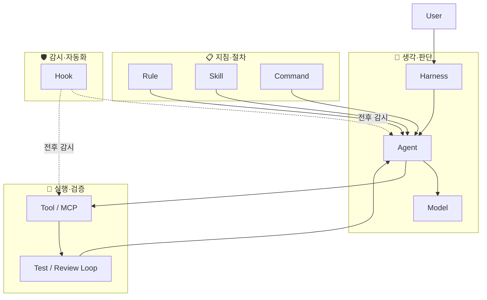

# UnitConverter_04 — Cursor Session Transcript

| 항목 | 값 |
|------|-----|
| Session ID | c771b08d-d5fa-4848-b845-aa0d22644bf5 |
| Export date | 2025-06-05 |
| Project | UnitConverter_04 |
| Raw JSONL | transcript_c771b08d.jsonl |
| Turns | 68 |

---

## Turn 1 — USER

@c:\DEV\UnitConverter_04\  프로젝트에서 아래 8계층 + Hook이 각각 무슨 역할인지 한 줄씩 설명해줘.
초보자용으로 비유(헌법, 매뉴얼, 버튼, CCTV 등)도 붙여줘.
- Model, Agent, Harness
- Rule, Skill, Command
- Tool/MCP, Test/Review Loop
- Hook
아직 .cursorrules, Skill, Command, hooks.json 은 없다고 가정.

---

## Turn 2 — ASSISTANT

프로젝트 구조와 각 계층이 어떻게 정의돼 있는지 먼저 살펴볼게요.

[REDACTED]

_[Tools: Glob, SemanticSearch]_

---

## Turn 3 — ASSISTANT

_[Response/tool activity redacted in export]_

_[Tools: Grep, Glob, Read, Read]_

---

## Turn 4 — ASSISTANT

_[Response/tool activity redacted in export]_

_[Tools: Read, Read, Read]_

---

## Turn 5 — ASSISTANT

`UnitConverter_04`는 아직 순수 Python 코드(`UnitConverter.py`, `README.md`)만 있고, Cursor 설정 파일은 없는 상태입니다. 아래 설명은 **이 프로젝트에 Cursor AI를 붙였을 때** 각 계층이 어떤 역할을 하는지, 초보자용 비유와 함께 정리한 것입니다.

---

## 전체 그림 (한눈에)



---

## 1층: Model, Agent, Harness — “누가, 어디서, 어떻게 생각하나”

| 계층 | 한 줄 설명 | 비유 |
|------|-----------|------|
| **Model** | 실제로 코드를 읽고, OCP/SRP 설계를 제안하고, 테스트 코드를 **문장으로 생성**하는 AI 두뇌. | **교수** — meter/feet 변환 공식을 이해하고 답을 내는 사람 |
| **Agent** | “입력 검증 추가해줘”, “TC 작성해줘” 같은 요청을 받아 **계획 → 파일 수정 → 테스트 실행** 순서로 일을 조율하는 실행자. | **현장 반장** — 교수( Model )에게 물어보고, 일 순서를 정해 진행 |
| **Harness** | Cursor IDE, Ask/Agent 모드, 열린 파일·프로젝트 경로(`c:\DEV\UnitConverter_04`) 등 AI가 일하는 **작업 환경 전체**. | **사무실 + 책상** — 교수와 반장이 앉아 일하는 공간 |

> 지금 상태: Harness(Cursor)만 있고, Model·Agent는 Cursor 기본 설정으로 동작 중. Rule/Skill 등은 아직 없음.

---

## 2층: Rule, Skill, Command — “항상 지켜야 할 것 / 특정 업무 매뉴얼 / 단축 버튼”

| 계층 | 한 줄 설명 | 비유 |
|------|-----------|------|
| **Rule** | “OCP 준수”, “커밋은 요청 시만”, “Python 스타일은 이렇게”처럼 **매 대화마다 항상 적용**되는 프로젝트 규칙 (`.cursor/rules/`, 사용자 Rule). | **헌법** — 어떤 작업이든 반드시 지켜야 하는 기본 원칙 |
| **Skill** | “단위 변환 TC 작성법”, “설정 파일(JSON) 외부화 절차”처럼 **특정 작업이 나올 때만** 꺼내 쓰는 전문 매뉴얼 (`SKILL.md`). | **직무 매뉴얼** — “테스트 코드 작성” 챕터만 필요할 때 펼치는 책 |
| **Command** | `/add-unit`, `/run-tests` 같은 **슬래시 명령**으로 자주 쓰는 프롬프트·워크플로를 한 번에 실행. | **원터치 버튼** — “TC 돌려” 버튼 한 번 누르면 정해진 절차 시작 |

> 지금 상태: `.cursorrules`, Skill, Command **없음** → Agent는 README 요구사항과 대화 내용만 보고 판단.

---

## 3층: Tool/MCP, Test/Review Loop — “손·발 + 품질 검사”

| 계층 | 한 줄 설명 | 비유 |
|------|-----------|------|
| *

_[...truncated for readability...]_

---

## Turn 6 — USER

UnitConverter_04 용 ECB + Dual-Track TDD용 최소 Harness를 만들어줘.
- pyproject.toml (pytest만)
- src/boundary, src/control, src/entity (빈 __init__.py)
- tests/entity, tests/control, tests/boundary (빈 __init__.py)
- Report/01, Report/02 는 이미 있다고 가정
코드·테스트 본문은 아직 작성하지 마. Harness 골격만.

---

## Turn 7 — ASSISTANT

프로젝트 현재 구조를 확인한 뒤 ECB + Dual-Track TDD용 Harness 골격만 추가합니다.

[REDACTED]

_[Tools: Glob, Read]_

---

## Turn 8 — ASSISTANT

_[Response/tool activity redacted in export]_

_[Tools: Write, Write, Write, Write, Write, Write, Write]_

---

## Turn 9 — ASSISTANT

pytest가 골격만으로 정상 동작하는지 확인합니다.

[REDACTED]

_[Tools: Shell]_

---

## Turn 10 — ASSISTANT

_[Response/tool activity redacted in export]_

_[Tools: Shell]_

---

## Turn 11 — ASSISTANT

ECB + Dual-Track TDD용 Harness 골격을 추가했습니다. 코드·테스트 본문은 넣지 않았습니다.

```
UnitConverter_04/
├── pyproject.toml
├── src/
│   ├── entity/__init__.py
│   ├── control/__init__.py
│   └── boundary/__init__.py
└── tests/
    ├── entity/__init__.py      ← Track 1 (Entity)
    ├── control/__init__.py     ← Track 1 (Control)
    └── boundary/__init__.py    ← Track 2 (Boundary)
```

**`pyproject.toml`** — pytest만 dev 의존성, `testpaths=tests`, `pythonpath=src`로 `src/` 모듈 import 준비.

**ECB ↔ Dual-Track 매핑**

| 계층 | 소스 | 테스트 트랙 |
|------|------|-------------|
| Entity | `src/entity/` | `tests/entity/` — 순수 도메인 (Track 1) |
| Control | `src/control/` | `tests/control/` — 유스케이스 조율 (Track 1) |
| Boundary | `src/boundary/` | `tests/boundary/` — I/O·통합 (Track 2) |

`Report/01`, `Report/02`는 생성하지 않았습니다. `pytest --collect-only`는 테스트 0건 수집(exit 5)으로 골격만 정상 동작합니다.

다음 단계로 `tests/entity/`부터 Red 테스트를 추가하면 됩니다.

[REDACTED]

---

## Turn 12 — USER

[Image]
[Image]
[Image]
[Image]
<image_files>
The following images were provdied by the user and saved to the workspace for future use:
1. C:\Users\usejen_id\.cursor\projects\c-DEV-UnitConverter-04/assets/c__Users_usejen_id_AppData_Roaming_Cursor_User_workspaceStorage_baaa0f73f0a06ddecb6fcd58dfb9e34a_images_image-94e28975-3457-48e7-8c51-1b5fd03700c1.png
2. C:\Users\usejen_id\.cursor\projects\c-DEV-UnitConverter-04/assets/c__Users_usejen_id_AppData_Roaming_Cursor_User_workspaceStorage_baaa0f73f0a06ddecb6fcd58dfb9e34a_images_image-d8f2b4b6-9468-4b34-8915-a0b118723ac4.png
3. C:\Users\usejen_id\.cursor\projects\c-DEV-UnitConverter-04/assets/c__Users_usejen_id_AppData_Roaming_Cursor_User_workspaceStorage_baaa0f73f0a06ddecb6fcd58dfb9e34a_images_image-f4aa4da0-97ed-421c-88ba-067526c851a9-65b72a2f-daa9-4aad-b58b-7c74282d8e11.png
4. C:\Users\usejen_id\.cursor\projects\c-DEV-UnitConverter-04/assets/c__Users_usejen_id_AppData_Roaming_Cursor_User_workspaceStorage_baaa0f73f0a06ddecb6fcd58dfb9e34a_images_image-ec29034d-cf23-484a-b75d-6083eec0af54-95114b8f-3a2d-4ad0-9120-d06e581a9e70.png

These images can be copied for use in other locations.
</image_files>
UnitConverter_04 프로젝트 자료 내용 포함해서 cursorrule 작성해줄 수 있을까?

---

## Turn 13 — ASSISTANT

프로젝트 구조와 Rule 작성 가이드를 확인한 뒤, 자료를 반영한 `.cursorrules` 초안을 제안하겠습니다.

[REDACTED]

_[Tools: Read, Glob, Read, Read]_

---

## Turn 14 — ASSISTANT

_[Response/tool activity redacted in export]_

_[Tools: Read, Read, Read]_

---

## Turn 15 — ASSISTANT

네, 가능합니다. 지금은 **Ask 모드**라 파일을 직접 만들 수는 없고, 아래 초안을 복사해 `.cursor/rules/`에 넣거나 **Agent 모드**로 전환하시면 제가 생성해 드릴 수 있습니다.

`Report/01`, `Report/02`, `Report/03`과 슬라이드 자료를 반영해 **Rule 3개**로 나눴습니다. (한 파일에 몰지 않고, Cursor 권장대로 관심사별 분리)

---

## 권장 파일 구조

```
.cursor/rules/
├── project-context.mdc      # alwaysApply — PRD·추적·우선순위
├── ecb-architecture.mdc     # src/** — ECB 배치·SRP·OCP
└── dual-track-tdd.mdc       # tests/** — Red/Green·Track A/B
```

---

## 1. `.cursor/rules/project-context.mdc`

```markdown
---
description: UnitConverter_04 PRD, 추적성, 우선순위
alwaysApply: true
---

# UnitConverter_04 — 프로젝트 컨텍스트

## 목표
레거시 `UnitConverter.py`(37줄)를 ECB + Dual-Track TDD로 재구현한다.
PRD·테스트·코드는 Report/01, Report/02와 1:1 추적한다.

## P0 (먼저)
- FR-01~05: 파싱, 전 단위 출력, 미지 단위/음수/형식 오류
- NFR-01~02: OCP(단위 추가 시 converter 미수정), SRP(4모듈 분리)
- 변환: 1m = 3.28084ft = 1.09361yd; feet↔yard는 meter 경유

## P1 (P0 Green 후)
- EXT-01: units.json/YAML 로드
- EXT-02: 동적 단위 등록 (예: 1 cubit = 0.4572 meter)
- EXT-03: `--format json|csv|table`

## 레거시 시드 — 하지 말 것
- `UnitConverter.py`의 if/elif 분기, 하드코딩 비율, main() 혼합 로직을 새 코드에 복사하지 않는다.
- `UnitConverter.py`는 참고용 시드로 유지; 신규 구현은 `src/`에만 둔다.

## 참고 문서
- `Report/01/PRD_Summary.md`
- `Report/02/Traceability_Matrix.md`
```

---

## 2. `.cursor/rules/ecb-architecture.mdc`

```markdown
---
description: ECB 계층 배치, OCP/SRP, 모듈 분리
globs: src/**/*.py
alwaysApply: false
---

# ECB 아키텍처

## 계층 배치
| 계층 | 경로 | 책임 |
|------|------|------|
| Entity | `src/entity/` | LengthUnit, UnitRegistry, Converter |
| Control | `src/control/` | 유스케이스 조율 (파싱 결과 → 변환 → 출력 조립) |
| Boundary | `src/boundary/` | InputParser, OutputFormatter, ConfigLoader, CLI |

## SRP (NFR-02) — 한 파일 = 한 역할
- Parser: `unit:value` 파싱·검증만
- Registry: 단위 등록·조회만
- Converter: meter 기준 변환만
- Formatter: json/csv/table 출력만

## OCP (NFR-01)
- 새 단위 추가: `LengthUnit` 구현 + `registry.register()` 또는 설정 1줄
- `converter.py` 핵심 로직은 수정하지 않는다
- `if/elif` 단위 분기 금지

## CLI (spec)
- 진입: `python -m unit_converter "meter:2.5"`
- Boundary에 `__main__.p

_[...truncated for readability...]_

---

## Turn 16 — USER

UnitConverter_04 루트에 .cursorrules 초안을 새로 만들어줘(현재 없음). 위 3가지 내용 모두 포함해서 .cursorrules 로 작성해야해.

---

## Turn 17 — ASSISTANT

`.cursorrules` 단일 파일로 3가지 Rule 내용을 합쳐 루트에 생성합니다.

[REDACTED]

_[Tools: Write]_

---

## Turn 18 — ASSISTANT

`.cursorrules`를 `UnitConverter_04` 루트에 생성했습니다.

**포함된 3개 섹션**

| 섹션 | 내용 |
|------|------|
| **1. 프로젝트 컨텍스트** | P0/P1 요구사항, 변환 로직, CLI spec, 레거시 금지 사항, Report 참조 |
| **2. ECB 아키텍처** | entity/control/boundary 배치, SRP 4모듈, OCP 규칙, CLI 진입점 |
| **3. Dual-Track TDD** | Track A/B 정의, pytest 명령, Red→Green 순서, 네이밍, Given/Then 표 |

Cursor가 이 프로젝트를 열면 루트 `.cursorrules`가 자동으로 컨텍스트에 반영됩니다. 다음으로 Skill이나 Command를 추가하려면 Agent 모드에서 말씀해 주세요.

[REDACTED]

---

## Turn 19 — USER

.cursorrules 초안을 리뷰하고 빠진 규칙이 있을지 검토해줘

---

## Turn 20 — ASSISTANT

`.cursorrules`와 Report·README를 대조해 빠진 규칙이 있는지 검토합니다.

[REDACTED]

_[Tools: Read, Read, Read, Read, Read, Read]_

---

## Turn 21 — ASSISTANT

`.cursorrules` 초안을 `Report/01~03`, `README.md`, `pyproject.toml`과 대조해 검토했습니다.

---

## 총평

**PRD·ECB·Dual-Track TDD의 핵심은 잘 담겨 있습니다.** P0/P1 우선순위, 레거시 금지, 계층 배치, Red→Green 순서, Given/Then 표까지 실습에 바로 쓸 수 있는 수준입니다.

다만 **spec 미확정 사항**, **테스트 배치 세부 규칙**, **구현 일관성 규칙**이 빠져 있어 Agent가 구현 단계에서 서로 다른 선택을 할 여지가 있습니다.

---

## 잘 된 점

| 항목 | 평가 |
|------|------|
| P0/P1 분리 | FR/NFR/EXT 전부 포함, P1은 P0 Green 후 명시 |
| 레거시 anti-pattern | if/elif, 하드코딩, main() 혼합 금지 명확 |
| ECB 매핑 | 슬라이드 모듈 ↔ `src/` 경로 대응 |
| Dual-Track | Track A/B, pytest 명령, Red 순서 일치 |
| 운영 규칙 | commit/범위 최소화/시드 유지 |

---

## 빠진 규칙 (우선 추가 권장)

### 1. 패키지명·CLI 진입점 미확정 (Report/01 갭)

`pyproject.toml`은 `name = "unit-converter"`인데, CLI spec은 `python -m unit_converter`입니다. Agent가 어느 쪽을 따를지 모호합니다.

**추가 권장:**
```
- 패키지/모듈명: unit_converter (CLI: python -m unit_converter)
- pyproject.toml name(unit-converter)와 모듈명(unit_converter) 구분을 명시
- Boundary에 unit_converter/__main__.py 배치 (또는 src/boundary/__main__.py + 패키지 구조 확정)
```

### 2. `tests/control/` 역할 미정의 (Report/03 갭 #4)

Track B에 `entity`와 `control`이 함께 있지만, **어떤 FR을 어느 폴더에 둘지** 규칙이 없습니다.

**Report/02 기준 추가 권장:**

| FR | 권장 폴더 |
|----|----------|
| FR-02 | `tests/entity/` (순수 변환) 또는 `tests/control/` (유스케이스) |
| FR-03, FR-04 | `tests/entity/` |
| NFR-01 | `tests/entity/` |
| EXT-02 | `tests/control/` |
| FR-01, FR-05 | `tests/boundary/` |

→ **"entity = 도메인 단위, control = 유스케이스 조율, boundary = I/O·CLI"** 한 줄 정의가 필요합니다.

### 3. NFR-02 검증 방법 누락

Report/02는 NFR-02를 **import 검사**로 검증한다고 합니다. 현재 Rule에는 "분리"만 있고 **어떻게 검증할지** 없습니다.

**추가 권장:**
```
- NFR-02: Parser/Registry/Converter/Formatter가 서로 import하지 않거나,
  boundary→control→entity 단방향 의존만 허용
- tests/boundary/에서 import 구조 검사 테스트 포함
```

### 4. ECB 의존 방향 규칙 없음

계층 배치는 있지만 **import 방향**이 없어 Entity가 Boundary를 import하는 실수를 막지 못합니다.

**추가 권장:**
```
- entity: 외부 계층 import 금지
- control: entity만 import
- boundary: control, entity import 가능
```

### 5. 파싱 경계 케이스 규칙 없음

레거시 문제 #5(`split(':', 1)` 취약)는 언급됐지만, **새 Parser가 처리해야 할 케이스**가 없습니다.

_[...truncated for readability...]_

---

## Turn 22 — USER

어떤식으로 보완할지 알려줘

---

## Turn 23 — ASSISTANT

_[Response/tool activity redacted in export]_

_[Tools: Read]_

---

## Turn 24 — ASSISTANT

보완은 **기존 3섹션 구조는 유지**하고, 빠진 “구현 표준”만 **4개 블록**으로 끼워 넣는 방식이 가장 좋습니다. 전체를 다시 쓰기보다 **어디에 무엇을 추가할지** 기준으로 정리했습니다.

---

## 보완 전략 (원칙)

| 원칙 | 이유 |
|------|------|
| 섹션 3개 유지 | 이미 읽기 좋음 — 구조 깨지 않음 |
| “규칙”만 추가, 설명·배경은 최소화 | Agent가 따르기 쉬운 짧은 문장 위주 |
| 미확정 spec은 **한 곳에서 확정** | 패키지명·오류 스타일·정밀도 등 |
| P0 규칙 먼저, P1(EXT)은 기존 표에 행만 추가 | 우선순위와 일치 |

**추천 최종 구조:**

```
1. 프로젝트 컨텍스트     ← Harness·정밀도·기본단위 추가
2. ECB 아키텍처         ← 의존 방향·Protocol·패키지/CLI 확정 추가
3. Dual-Track TDD       ← FR별 폴더·오류·파싱 경계·EXT Given/Then 추가
   (신규) 4. 구현 표준   ← 짧은 체크리스트 (선택, 또는 2·3에 분산)
```

---

## 1섹션 보완 — `프로젝트 컨텍스트`

**삽입 위치:** `### 변환 로직` 바로 아래

```markdown
### Harness (pyproject.toml)
- Python >= 3.10, dev 의존성은 pytest만 (불필요한 패키지 추가 금지)
- `pythonpath = ["src"]` — 테스트·코드 import는 `entity.*`, `control.*`, `boundary.*`
- 전체 실행: `pytest -v` / Track별은 §3 참조

### 출력·검증 정밀도
- PRD/Report 기준: 소수 4자리 (예: 8.2021 feet)
- README의 8.2 feet는 반올림 예시; 테스트는 `pytest.approx(..., rel=1e-4)` 사용
- 기본 출력 포맷: table (`2.5 meter = 8.2021 feet` 형식)

### 기본 단위 부트스트랩
- Registry 초기 등록: meter, feet, yard
- 1m = 3.28084ft, 1m = 1.09361yd (feet↔yard는 meter 경유)
```

**삽입 위치:** `### 참고 문서`에 한 줄 추가

```markdown
- `README.md` (원본 요구), `Report/03/Progress_Status.md` (진행 추적)
```

---

## 2섹션 보완 — `ECB 아키텍처`

**삽입 위치:** `### CLI (spec)` — **모호함 해소가 핵심**

기존 내용을 아래로 **교체·확장**:

```markdown
### 패키지·CLI (확정 spec)
- PyPI/프로젝트명: `unit-converter` (pyproject.toml)
- Python 모듈·CLI: `unit_converter` → `python -m unit_converter "meter:2.5"`
- 진입점: `src/boundary/`에 `__main__.py` 또는 `cli.py` + `-m` 실행 경로
- 레거시 `python UnitConverter.py`는 시드 참고용; 신규 CLI로 대체

### 계층 의존 방향 (위반 금지)
- `entity` → 외부 계층 import 금지
- `control` → `entity`만 import
- `boundary` → `control`, `entity` import 가능
- Parser/Registry/Converter/Formatter는 서로 직접 호출·import 최소화 (NFR-02)

### LengthUnit (OCP 핵심)
- `Protocol` 또는 동등 인터페이스: `name: str`, `to_meter(value: float) -> float`
- 신규 단위: `LengthUnit` 구현 + `registry.register()` (converter 수정 없음)
```

**삽입 위치:** `### SRP` 아래 — 파싱 책임 명확화

```

_[...truncated for readability...]_

---

## Turn 25 — USER

기준은 아까 첨부해준 project 자료를 기준으로 하고 README에서 틀린 부분 있으면 이부분 수정해줘

---

## Turn 26 — ASSISTANT

README와 Report·PRD 자료를 대조해 틀린 부분을 찾겠습니다.

[REDACTED]

_[Tools: Read, Read, Read, Read]_

---

## Turn 27 — ASSISTANT

`README.md`를 PRD 슬라이드·`Report/01`·`Report/02` 기준으로 대조했습니다. **틀리거나 모호한 부분**과 **수정안**을 정리합니다.

지금은 **Ask 모드**라 파일을 직접 수정할 수 없습니다. 아래 내용을 반영하려면 **Agent 모드**로 전환해 주세요.

---

## README에서 틀린/모호한 부분

| # | README 현재 | 프로젝트 자료 (정본) | 판정 |
|---|------------|---------------------|------|
| 1 | `8.2 feet`, `2.7 yard` | `8.2021 feet`, `2.7340 yard` (FR-02) | **오류** — 반올림 1자리, 정밀도 불일치 |
| 2 | `python UnitConverter.py` 만 안내 | `python -m unit_converter "meter:2.5"` (PRD CLI) | **구식** — 타깃 CLI 미반영 |
| 3 | SRP: "클래스 구성" (추상적) | Parser / Registry / Converter / Formatter 분리 (NFR-02) | **모호** |
| 4 | 출력: "JSON / CSV / 표" | `--format json \| csv \| table` (EXT-03) | **누락** — CLI 플래그 없음 |
| 5 | 설정: "JSON/YAML" | `units.json` 또는 YAML (EXT-01) | **모호** — 예시 파일명 없음 |
| 6 | 아키텍처·테스트 구조 없음 | ECB + Dual-Track TDD, `src/`·`tests/` | **누락** (틀린 건 아니나 자료와 불일치) |

**맞는 부분 (수정 불필요):** 입력 형식 `meter:2.5`, 기본 3단위, 변환 비율 상수, OCP, 입력 검증 3종, EXT-02 cubit 예시, Activities 일정.

---

## 수정안 (섹션별)

### 1. `### 가상환경 설정 및 실행` — 교체

```markdown
### 가상환경 설정 및 실행
```bash
# 가상환경 생성
python -m venv venv

# 가상환경 활성화 (Windows)
venv\Scripts\activate

# 가상환경 활성화 (macOS/Linux)
source venv/bin/activate

# 레거시 시드 실행 (분석·참고용)
python UnitConverter.py

# 타깃 CLI 실행 (ECB 재구현 후)
python -m unit_converter "meter:2.5"

# 테스트 (Dual-Track)
pytest tests/entity tests/control -v   # Track B — 도메인
pytest tests/boundary -v               # Track A — CLI·통합

# 가상환경 비활성화
deactivate
```
```

### 2. `### 기본 요구사항` 항목 1 출력 예시 — 수정

**Before:**
```
2.5 meter = 8.2 feet
2.5 meter = 2.7 yard
```

**After:**
```
2.5 meter = 8.2021 feet
2.5 meter = 2.7340 yard
...
```

> 근거: `Report/01` L18, `Report/02` FR-02 Then (`feet≈8.2021, yard≈2.7340`)

### 3. `### 품질 요구사항` — SRP 구체화

**Before:**
```markdown
- SRP를 만족하는 클래스 구성
```

**After:**
```markdown
- SRP: Parser / Registry / Converter / Formatter 모듈 분리
```

### 4. `### 추가 요구사항` — EXT 플래그·파일명 명시

**Before:**
```markdown
- **설정 외부화**
   - 변환 비율을 외부 설정 파일(JSON/YAML)에서 로드
...
- **출력 포맷 선택 기능** 
   - JSON / CSV

_[...truncated for readability...]_

---

## Turn 28 — USER

.cursorrules 보완이랑 README 파일 수정 같이 진행해줘

---

## Turn 29 — ASSISTANT

`.cursorrules` 보완과 `README.md` 수정을 함께 진행합니다.

[REDACTED]

_[Tools: Read, Read]_

---

## Turn 30 — ASSISTANT

_[Response/tool activity redacted in export]_

_[Tools: Write, Write]_

---

## Turn 31 — ASSISTANT

두 파일을 프로젝트 자료(PRD·Report/01~02) 기준으로 반영했습니다.

---

## `.cursorrules` 보완 (134줄 → 186줄)

| 추가 항목 | 내용 |
|----------|------|
| Harness | pytest only, `pythonpath`, Python >= 3.10 |
| 정밀도 | 소수 4자리, `pytest.approx(rel=1e-4)`, 기본 table |
| 기본 단위 | Registry 초기 meter/feet/yard 부트스트랩 |
| 의존 방향 | entity ← control ← boundary |
| LengthUnit | Protocol (`name`, `to_meter`) |
| Parser 경계 | `meter:2.5:extra`, 빈 값, trim 허용 |
| 패키지·CLI | `unit-converter` vs `unit_converter` 구분 확정 |
| FR별 테스트 폴더 | entity/control/boundary 고정 매핑 |
| EXT Given/Then | EXT-01~03 표 추가 |
| 오류 처리 | 도메인 예외 + boundary 메시지 |
| C2C | docstring ID, Report/02 갱신 권장 |

---

## `README.md` 수정

| 항목 | Before | After |
|------|--------|-------|
| 출력 예시 | 8.2 / 2.7 | **8.2021 / 2.7340** |
| 실행 | `UnitConverter.py`만 | 레거시 + **`python -m unit_converter`** + pytest |
| SRP | 클래스 구성 | **Parser/Registry/Converter/Formatter** |
| EXT | JSON/YAML, 표 | **`units.json`**, **`--format json\|csv\|table`** |
| 신규 | — | **프로젝트 방향**(ECB, Dual-Track, Report 참조) |

다음 단계로 P0 Red 테스트(FR-02부터)를 시작할 수 있습니다.

[REDACTED]

---

## Turn 32 — USER

이제 skill, command 초안을 만들어야 spec 구상이 끝나는데 어떻게 하면 될까?

---

## Turn 33 — ASSISTANT

프로젝트 spec과 Skill/Command 작성 가이드를 확인해 초안 구성을 제안하겠습니다.

[REDACTED]

_[Tools: Read, Read, Read, Glob]_

---

## Turn 34 — ASSISTANT

Skill·Command 초안은 **Rule(헌법)과 역할을 나눠** 최소 세트로 만드는 게 좋습니다. `Report/03`과 `.cursorrules` 기준으로 정리했습니다.

---

## 먼저 역할 구분

| 계층 | 역할 | UnitConverter_04 예 |
|------|------|---------------------|
| **Rule** (`.cursorrules`) | 항상 지킬 원칙 | ECB, FR 순서, OCP/SRP ✅ 완료 |
| **Skill** | **절차·노하우** (어떻게 할지) | Red 테스트 작성법, 단위 추가법 |
| **Command** | **원터치 프롬프트** (무엇을 실행할지) | `/track-b`, `/red-fr02` |

> Rule = "무엇을 지킬지" / Skill = "어떻게 할지" / Command = "지금 이걸 해줘"

---

## 권장 파일 구조 (프로젝트 스킬·커맨드)

```
UnitConverter_04/
├── .cursorrules              ✅ 있음
└── .cursor/
    ├── skills/
    │   ├── dual-track-red/
    │   │   └── SKILL.md      ← P0 Red 작성 절차
    │   └── add-length-unit/
    │       └── SKILL.md      ← NFR-01/OCP 단위 추가
    └── commands/
        ├── track-b.md        ← Track B pytest
        ├── track-a.md        ← Track A pytest
        ├── red-fr02.md       ← FR-02 Red 시작
        └── green-entity.md   ← entity Green 최소 구현
```

- **위치**: 실습 공유용이면 `.cursor/skills/` (프로젝트)
- **개인용**이면 `~/.cursor/skills/` — 이 프로젝트는 **프로젝트 스킬** 권장

---

## Skill 초안 2개 (핵심)

### 1. `dual-track-red` — 가장 먼저

**언제 쓰나**: "FR-02 Red 테스트 작성해줘", "P0 Red 시작" 할 때

```markdown
---
name: dual-track-red
description: >-
  UnitConverter_04 Dual-Track TDD Red 단계. FR/NFR별 Red 테스트 파일 작성,
  Given/Then docstring, Track A/B 폴더 배치. Red 테스트·실패 확인까지만.
---

# Dual-Track Red

## 전제
- `.cursorrules`, `Report/02/Traceability_Matrix.md` 준수
- Red만 — src 구현은 Green 단계까지 하지 않음 (최소 import stub만 허용)

## 절차
1. FR ID 확인 (P0 순서: FR-02 → FR-04/03 → FR-01/05 → NFR-01/02)
2. Track·폴더 결정 (.cursorrules §3 FR별 폴더 표)
3. `tests/{entity|control|boundary}/test_{fr_id}_{slug}.py` 생성
4. docstring 첫 줄: `FR-02: 전 단위 출력`
5. Given/Then을 assert/raises로 표현
6. `pytest.approx(..., rel=1e-4)` (FR-02)
7. `pytest` 실행 → **실패(Red) 확인** 후 종료

## 파일·폴더 매핑 (고정)
| ID | 폴더 |
|----|------|
| FR-01, FR-05 | tests/boundary/ |
| FR-02, FR-03, FR-04, NFR-01 | tests/entity/ |
| NFR-02 | tests/boundary/ |
| EXT-02 | tests/control/ |

## Red 템플릿 (FR-02 예)
```python
"""FR-02

_[...truncated for readability...]_

---

## Turn 35 — USER

[Image]
<image_files>
The following images were provdied by the user and saved to the workspace for future use:
1. C:\Users\usejen_id\.cursor\projects\c-DEV-UnitConverter-04/assets/c__Users_usejen_id_AppData_Roaming_Cursor_User_workspaceStorage_baaa0f73f0a06ddecb6fcd58dfb9e34a_images_image-204e2cb4-81ba-4a52-901e-4e07cb5fccf3.png

These images can be copied for use in other locations.
</image_files>
이거 참고해서 이제 RED테스트 이전에 skill이랑 command 작업해야하는데 맞나 확인해줘

---

## Turn 36 — ASSISTANT

_[Response/tool activity redacted in export]_

_[Tools: Read, Glob]_

---

## Turn 37 — ASSISTANT

**맞습니다.** 슬라이드 8계층 흐름과 `Report/03` 권장 순서 모두 **RED 테스트(Test/Review Loop) 전에 Skill·Command를 끝내는 것**이 맞습니다.

---

## 8계층에서의 위치

슬라이드 순서를 실습 단계로 보면:

```
Model / Agent        → Cursor IDE (이미 있음)
Harness              → pyproject.toml, src/, tests/  ✅
Rule                 → .cursorrules                   ✅
Skill                → .cursor/skills/                ⬜ ← 지금
Command              → .cursor/commands/              ⬜ ← 지금
Tool / MCP           → pytest, 파일편집 등            (RED 때 사용)
Test / Review Loop   → RED → Green → Refactor         ⬜ 다음
Hook                 → hooks.json                     (Green 이후, 선택)
```

**Skill·Command는 “지침·절차” 계층**, **RED는 “검증” 계층**이라서 spec 구상 관점에서는 Skill/Command가 먼저입니다.

---

## 현재 프로젝트 상태

| 계층 | 상태 | 비고 |
|------|------|------|
| Harness | ✅ | ECB + Dual-Track 골격 |
| Rule | ✅ | `.cursorrules` (Report/03은 아직 “미착수”로 적혀 있음 — 갱신 필요) |
| Skill | ❌ | `.cursor/` 폴더 자체 없음 |
| Command | ❌ | 동일 |
| RED | ❌ | `tests/`에 `__init__.py`만 |

→ **RED 들어가기 전에 Skill·Command 초안을 만드는 게 맞는 타이밍**입니다.

---

## “반드시” vs “권장”

| | 설명 |
|---|------|
| **기술적으로** | Skill/Command 없이도 RED 테스트 파일을 직접 작성 가능 |
| **spec·실습 목적상** | Skill/Command 먼저가 맞음 — FR별 Red 절차·Track 실행이 매번 `.cursorrules`만으로 반복되지 않음 |
| **Hook** | RED **이전이 아님** — Green 사이클 돌린 뒤 추가 (Report/03 #7) |

---

## spec 완료 기준 (RED 전 체크리스트)

```
✅ Report/01, 02
✅ Harness (pyproject, src/, tests/)
✅ Rule (.cursorrules)
⬜ Skill  dual-track-red
⬜ Skill  add-length-unit        (P0 중엔 선택, NFR-01 전에 필요)
⬜ Command /track-b, /track-a
⬜ Command /red-fr02             (첫 RED 진입용)
⬜ (선택) /green-entity
────────── spec 끝 ──────────
⬜ P0 RED: FR-02부터
```

**최소 spec 완료**: Skill 1개(`dual-track-red`) + Command 3개(`/track-b`, `/track-a`, `/red-fr02`)

---

## 권장 작업 순서 (지금)

1. `.cursor/skills/dual-track-red/SKILL.md`
2. `.cursor/commands/track-b.md`, `track-a.md`, `red-fr02.md`
3. 채팅에서 `/red-fr02` 실행 → Red 실패 확인 (spec 검증)
4. 그다음 FR-02 Red 본격 작성 → Green

---

## 한 줄 결론

> **Skill·Command를 RED 이전에 하는 판단이 맞습니다.** Rule·Harness까지 끝났으니,

_[...truncated for readability...]_

---

## Turn 38 — USER

skill 어떻게 작성할지 초안 알려줘

---

## Turn 39 — ASSISTANT

`.cursorrules`와 Report를 기준으로 Skill 초안 형식을 정리합니다.

[REDACTED]

_[Tools: Read, Read]_

---

## Turn 40 — ASSISTANT

Skill은 **프로젝트 루트**에 아래 구조로 두면 됩니다.

```
.cursor/skills/
├── dual-track-red/
│   └── SKILL.md      ← P0 필수 (RED 작성)
└── add-length-unit/
    └── SKILL.md      ← NFR-01 전에 (단위 추가)
```

Rule(`.cursorrules`)에 있는 내용은 **복붙하지 말고** “`.cursorrules` §3 참조”로 연결하세요.

---

## Skill 1: `dual-track-red` (필수)

**파일:** `.cursor/skills/dual-track-red/SKILL.md`

```markdown
---
name: dual-track-red
description: >-
  Writes UnitConverter_04 Dual-Track TDD Red tests per FR/NFR ID.
  Places tests in tests/entity, tests/control, or tests/boundary,
  adds Given/Then docstrings, runs pytest to confirm failure.
  Use when the user asks for Red tests, TDD Red phase, FR-02 Red,
  or starting P0 test implementation.
---

# Dual-Track Red

## When to use
- User requests Red test for a specific FR/NFR (e.g. "FR-02 Red")
- User says "P0 Red 시작", "테스트 먼저 작성"
- Command `/red-fr02` 등 Red 단계 실행

## Prerequisites
- Read `.cursorrules` and `Report/02/Traceability_Matrix.md`
- Harness exists: `pyproject.toml`, `src/`, `tests/`
- **Red only** — do not implement `src/` production code (import stub OK)

## P0 Red order (do not skip)
1. FR-02 → FR-04 → FR-03 → FR-01 → FR-05 → NFR-01 → NFR-02
2. P1 EXT only after P0 Green

## Step-by-step

### 1. Identify FR ID and folder
| ID | Folder |
|----|--------|
| FR-01, FR-05 | `tests/boundary/` |
| FR-02, FR-03, FR-04, NFR-01 | `tests/entity/` |
| NFR-02 | `tests/boundary/` (+ import structure test) |
| EXT-02 | `tests/control/` |

### 2. Create test file
- Name: `test_{id}_{slug}.py` (e.g. `test_fr02_convert_all_units.py`)
- Module docstring or test docstring first line: `FR-02: 전 단위 출력`

### 3. Write Given/Then as asserts
- FR-02: `pytest.approx(..., rel=1e-4)` for 8.2021 / 2.7340
- FR-03/04: `pytest.raises(UnknownUnitError)` / `pytest.raises(NegativeValueError)`
- FR-05: `pytest.raises(InvalidFormatError)` or equivalent

### 4. Run pytest and confirm Red
```powershell
# Track B
pytest tests/entity tests/control -v -k "fr02"

# Track A
pytest tests/boundary -v -k 

_[...truncated for readability...]_

---

## Turn 41 — USER

skill 초안 작성해줘. 
description : UnitConverter_04 Dual-Track TDD·ECB 개발 시 Agent가 따를 절차

---

## Turn 42 — ASSISTANT

프로젝트 Skill 초안을 `.cursor/skills/`에 생성합니다.

[REDACTED]

_[Tools: Read]_

---

## Turn 43 — ASSISTANT

_[Response/tool activity redacted in export]_

_[Tools: Write]_

---

## Turn 44 — ASSISTANT

Skill 초안을 생성했습니다.

**경로:** `.cursor/skills/dual-track-ecb/SKILL.md`

**구성:**

| 섹션 | 내용 |
|------|------|
| §1 ECB 계층 | entity/control/boundary, 의존 방향, SRP, OCP |
| §2 Dual-Track | Track A/B, FR별 테스트 폴더, 네이밍 |
| §3 Red | P0 순서, Given/Then, pytest 실패 확인 |
| §4 Green | entity → control → boundary, 오류 처리 |
| §5 Refactor | OCP/SRP 정리, 회귀 |
| §6 신규 단위 | NFR-01 OCP 절차 |
| §7 P1 EXT | EXT-01~03 (P0 Green 후) |
| Do NOT | 금지 사항 |

**사용법:**
- 채팅에서 `@dual-track-ecb` 또는 "FR-02 Red 작성해줘"
- Command `/red-fr02`에서 "dual-track-ecb 스킬 따라…"로 연동

다음으로 Command 초안(`/track-b`, `/red-fr02` 등)도 만들까요?

[REDACTED]

---

## Turn 45 — USER

.cursor/commands/tdd-red.md 를 새로 만들어줘.
UnitConverter_04 Dual-Track TDD - RED 단계만 
# TDD RED — 실패 테스트 먼저
## 필수 선언 (첫 줄: Phase: red | Layer: ... | Track: ...)
## 절차 (ID 확인 → AAA 테스트 → pytest FAIL)
## pytest 예시 (bash)
## 보고 (테스트 ID, FAIL 요약, 변경 파일 tests/만)
## 금지 (src/ 수정, Domain Mock on Logic Track, assert 완화)
Skill 파일은 만들지 마.

---

## Turn 46 — ASSISTANT

`.cursorrules`와 프로젝트 구조를 확인한 뒤 `tdd-red` Command를 작성합니다.

[REDACTED]

_[Tools: Read, Glob]_

---

## Turn 47 — ASSISTANT

_[Response/tool activity redacted in export]_

_[Tools: Write]_

---

## Turn 48 — ASSISTANT

`.cursor/commands/tdd-red.md`를 생성했습니다.

**사용:** 채팅에서 `/tdd-red` 입력

**포함 내용:**

| 섹션 | 내용 |
|------|------|
| 필수 선언 | `Phase: red \| Layer: ... \| Track: ... \| ID: ...` |
| 절차 | ID 확인 → Layer/Track 매핑 → AAA 테스트 → pytest FAIL |
| pytest 예시 | Track B/A, `-k` 필터, 단일 파일 |
| 보고 | 테스트 ID, FAIL 요약, `tests/`만 변경 |
| 금지 | `src/` 수정, Logic Track Domain Mock, assert 완화 |

Skill 파일은 추가하지 않았습니다.

[REDACTED]

---

## Turn 49 — USER

.cursor/commands/review-ecb.md 를 새로 만들어줘.
코드 수정 금지, ECB·계약 위반만 표로 리뷰.
이건 Test/Review Loop용이야.

---

## Turn 50 — ASSISTANT

_[Response/tool activity redacted in export]_

_[Tools: Read, Read]_

---

## Turn 51 — ASSISTANT

_[Response/tool activity redacted in export]_

_[Tools: Write]_

---

## Turn 52 — ASSISTANT

`.cursor/commands/review-ecb.md`를 생성했습니다.

**사용:** 채팅에서 `/review-ecb`

**역할 (Test/Review Loop):** 코드 수정 없이 ECB·FR/NFR 계약 위반만 표로 검수

| 섹션 | 내용 |
|------|------|
| 필수 선언 | `Phase: review \| Scope: ... \| Layer: ...` |
| 검사 A~E | ECB 계층, SRP/OCP, FR 계약, Dual-Track 배치, 오류 처리 |
| 보고 | 요약표 + 위반 목록표 + FR별 테스트 현황표 + 권고(텍스트만) |
| 금지 | 파일 수정, 자동 리팩터, Skill 생성 |

`/tdd-red`(Red) → 구현(Green) → `/review-ecb`(Review) 흐름으로 쓰면 됩니다.

[REDACTED]

---

## Turn 53 — USER

UnitConverter_04 마무리 점검. 코드·파일 수정하지 마.
[주제 1문장]
[.cursorrules 요약 또는 전문]
[Command/Skill 목록]
[hooks.json 유무]
8계층+Hook 관점 ✅/⚠️/❌:
| 계층 | 상태 | 근거 |
| Model | | (설정만) |
| Agent | | Ask/Agent 역할 분리 |
| Harness | | src/tests/pytest |
| Rule | | .cursorrules |
| Skill | | |
| Command | | |
| Tool/MCP | | pytest 등 |
| Test/Review Loop | | 성공 기준·리뷰 Command |
| Hook | | |
계층 간 역할 중복·빈 구멍 1가지만 권고.

---

## Turn 54 — ASSISTANT

프로젝트 현황을 읽기 전용으로 점검합니다.

[REDACTED]

_[Tools: Glob, Read, Glob]_

---

## Turn 55 — ASSISTANT

_[Response/tool activity redacted in export]_

_[Tools: Read, Read, Read, Grep, Read, Read]_

---

## Turn 56 — ASSISTANT

**UnitConverter_04 spec 단계 마무리 점검** — 레거시 시드를 ECB + Dual-Track TDD로 재구현하기 위한 Rule·Skill·Command·Harness는 갖춰졌고, RED 테스트·Green 구현·Hook은 아직 미착수입니다.

---

## `.cursorrules` 요약 (189줄, 루트 전문 존재)

| 섹션 | 핵심 |
|------|------|
| **§1 컨텍스트** | P0 FR-01~05 + NFR-01~02, P1 EXT-01~03, 변환 비율·CLI spec, 레거시 금지, Harness·정밀도 |
| **§2 ECB** | entity/control/boundary 배치, 의존 방향, LengthUnit·OCP·SRP, Parser 경계, `unit_converter` CLI |
| **§3 Dual-Track TDD** | Track A/B, FR별 테스트 폴더, Red→Green 순서, Given/Then, 오류 처리, C2C 추적 |

> 전문: `c:\DEV\UnitConverter_04\.cursorrules`

---

## Command / Skill 목록

| 유형 | 이름 | 경로 | 역할 |
|------|------|------|------|
| **Skill** | `dual-track-ecb` | `.cursor/skills/dual-track-ecb/SKILL.md` | Red/Green/Refactor·ECB·OCP 전체 절차 |
| **Command** | `/tdd-red` | `.cursor/commands/tdd-red.md` | RED만 — AAA 테스트 → pytest FAIL |
| **Command** | `/review-ecb` | `.cursor/commands/review-ecb.md` | Test/Review — ECB·계약 위반 표 리뷰 (수정 금지) |

---

## `hooks.json` 유무

**없음** — `.cursor/hooks.json` 및 hook 스크립트 미생성 (`Report/03`과 동일)

---

## 8계층 + Hook

| 계층 | 상태 | 근거 |
|------|------|------|
| **Model** | ✅ | Cursor 기본 모델 사용; 프로젝트별 모델 설정 없음 (설정만) |
| **Agent** | ✅ | Ask(점검·설명) / Agent(파일 생성) 세션에서 역할 분리 사용 |
| **Harness** | ✅ | `pyproject.toml`(pytest), `src/{entity,control,boundary}/`, `tests/` ECB 3계층, `pythonpath=src` |
| **Rule** | ✅ | `.cursorrules` 189줄 — PRD·ECB·Dual-Track·FR Given/Then·구현 표준 포함 |
| **Skill** | ✅ | `dual-track-ecb` 1개 — description·Red/Green/Refactor·OCP 절차 |
| **Command** | ⚠️ | `/tdd-red`, `/review-ecb` 2개 — **Green·Track 실행 Command 없음** |
| **Tool/MCP** | ⚠️ | pytest Harness만; `src/`·테스트 본문 없어 Tool 루프 미검증, MCP 미연동 |
| **Test/Review Loop** | ⚠️ | Red·Review Command 있음; FR Red/Green ❌ (`Report/02`), **성공 기준(Green) Command 부재** |
| **Hook** | ❌ | `hooks.json` 없음 — 저장 후 자동 pytest·위험 명령 차단 없음 |

---

## 산출물 현황 (코드)

| 항목 | 상태 |
|------|------|
| `UnitConverter.py` | 레거시 시드 37줄 (유지) |
| `src/` | `__init__.py`만 (본문 없음) |
| `tests/` | `__init__.py`만 (Red 테스트 없음) |

_[...truncated for readability...]_

---

## Turn 57 — USER

hooks.json + session-init.sh 만들어줘

---

## Turn 58 — ASSISTANT

_[Response/tool activity redacted in export]_

_[Tools: Read, Read, Glob]_

---

## Turn 59 — ASSISTANT

_[Response/tool activity redacted in export]_

_[Tools: Grep, Grep]_

---

## Turn 60 — ASSISTANT

_[Response/tool activity redacted in export]_

_[Tools: Grep, Grep]_

---

## Turn 61 — ASSISTANT

_[Response/tool activity redacted in export]_

_[Tools: Grep]_

---

## Turn 62 — ASSISTANT

_[Response/tool activity redacted in export]_

_[Tools: WebSearch]_

---

## Turn 63 — ASSISTANT

_[Response/tool activity redacted in export]_

_[Tools: Grep]_

---

## Turn 64 — ASSISTANT

_[Response/tool activity redacted in export]_

_[Tools: Read, Read, Read]_

---

## Turn 65 — ASSISTANT

프로젝트 컨텍스트에 맞춰 `hooks.json`과 `session-init.sh`를 생성합니다.

[REDACTED]

_[Tools: Write, Write, Write, Write]_

---

## Turn 66 — ASSISTANT

사용자가 요청한 `hooks.json`과 `session-init.sh`만 남기고, 추가로 만든 hook은 제거합니다.

[REDACTED]

_[Tools: Write, Delete, Delete, Shell]_

---

## Turn 67 — USER

Report 폴더에 보고서 생성하고, Prompting 폴더에 Transcript도 Export 해줘

---

## Turn 68 — ASSISTANT

_[Response/tool activity redacted in export]_

_[Tools: Glob, Read, Glob]_

---
